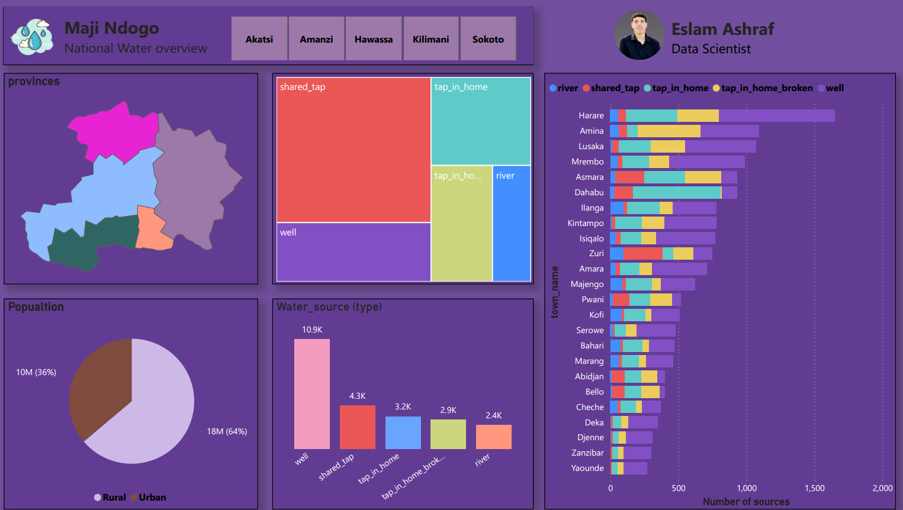
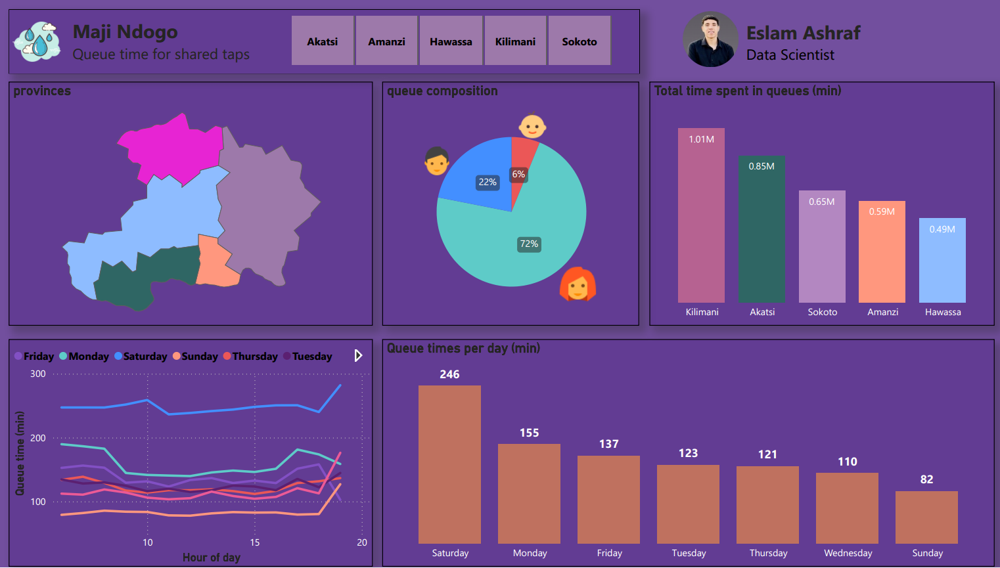
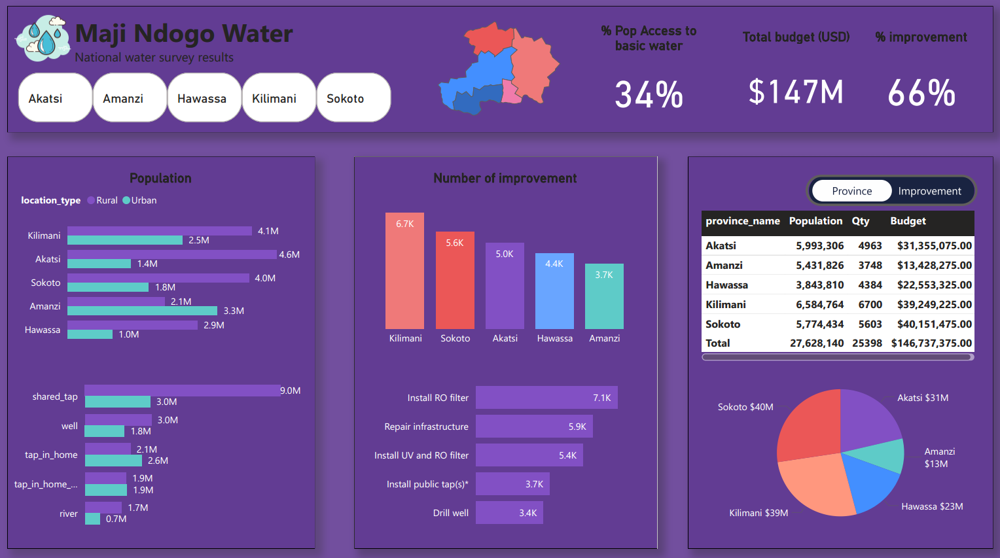
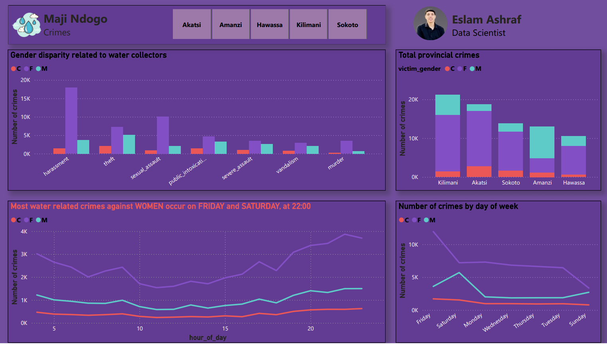
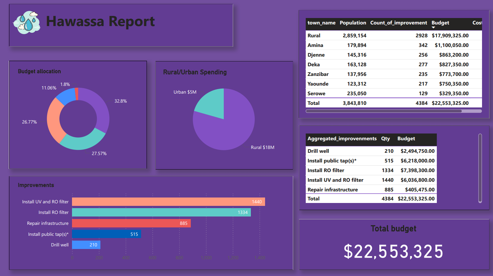

<!-- ----------------------------------------------------------
 README | Maji Ndogo — Water Resources Dashboard in Power BI
 Author: ELSAHM 32 • Updated: 2025-06-18
------------------------------------------------ -->

<h1 align="center">💧 Maji Ndogo — Water Access & Infrastructure Dashboard (Power BI)</h1>

  
  
  

> **Power BI Portfolio Project** uncovering hidden patterns in national water data: access inequality, infrastructure gaps, time loss, gender risks, and budget misallocation.
> Designed with a clean layout, deep DAX measures, and storytelling to empower stakeholders.

---

## 🚀 Why This Project Matters

| Real-World Challenge                 | How I Tackled It                          |
| ------------------------------------ | ----------------------------------------- |
| National water access below 34%      | Visual map + access KPIs + source types   |
| Long queues, 1.01M min/week wasted   | Queue visualizations by area + time       |
| Gender-based safety risks            | Drill-throughs on collection hour/gender  |
| Budget inefficiency & poor ROI       | Cost/improvement + province comparisons   |
| Infrastructure prioritization needed | RO filters vs Public taps vs Wells mapped |

This project simulates **data storytelling for a national NGO/government team**: from cleaning and modeling to dashboard design and policy insights.

---

## ✨ Visual Preview

| National Access                                     | Queue Time                                      | Budget & Improvements                                 |
| --------------------------------------------------- | ----------------------------------------------- | ----------------------------------------------------- |
|  |   |  |

| Source Types & Gender Risks                             | Hawassa Report                                             |
| ------------------------------------------------------- | ---------------------------------------------------------- |
|  |          |

---

## 🛠️ Tools & Skills Demonstrated

* ✅ Excel Power Query for cleaning and transformation
* ✅ Power BI: Data modeling, slicers, navigation, drill-through
* ✅ DAX for queue metrics, crime risk index, ROI, cost per impact
* ✅ Conditional formatting for red-flagging risks and disparities
* ✅ SQL (initial data extraction)

---

## 📊 Dashboard Highlights

* **National Access View**: % access, source type split, population served
* **Queue & Crime View**: Wait times, wasted minutes, gender-based incidents
* **Budget View**: \$147M spend by province, cost per improvement
* **Improvement Strategies**: Cost/unit, ROI, reach of each intervention
* **Disparity Tracker**: Urban vs Rural, Gender risks, Province inequalities

---

## 📌 Key Insights & Recommendations

| # | Insight                                         | Action Recommendation                        |
| - | ----------------------------------------------- | -------------------------------------------- |
| 1 | 34% access nationwide                           | Prioritize regions <30% in funding round 1   |
| 2 | Avg queue = 155 min (246 min in Kilimani)       | Add taps; redesign collection schedules      |
| 3 | 1.01M minutes wasted weekly                     | Promote in-home taps; reduce queue points    |
| 4 | Women 20x more at risk at night                 | Add lighting & female-safe collection zones  |
| 5 | Sokoto spends most but has lower ROI            | Audit Sokoto; replicate Akatsi practices     |
| 6 | RO filters cost \$5.9K/unit = best ROI          | Make RO filters the go-to improvement        |
| 7 | Kilimani has longest queues but low budget (9%) | Shift more budget to high-queue zones        |
| 8 | 1,900 work years lost to queues yearly          | Add collection points + water delivery pilot |

---

## 🧠 What This Project Shows About Me

* ✅ Ability to derive **real-world insights from public sector data**
* ✅ Strong grasp of **Power BI end-to-end process**
* ✅ Creative DAX for ranking, indexing, benchmarking
* ✅ Thoughtful dashboard layout for stakeholders & decision-makers

---

## 👤 About Me

**Eslam Ashraf** — Data Analyst passionate about building dashboards that impact lives. I specialize in Excel, Power BI, SQL, and telling data stories with real impact.

📧 [Email](mailto:islamashraf.b@gmail.com) • 👤 [LinkedIn](https://www.linkedin.com/in/eslamashraff/)

> *“Data is more than numbers—it's insight waiting to be unlocked.”*

---

### ⭐ Like what you see? **Star the repo** to support this open portfolio!
